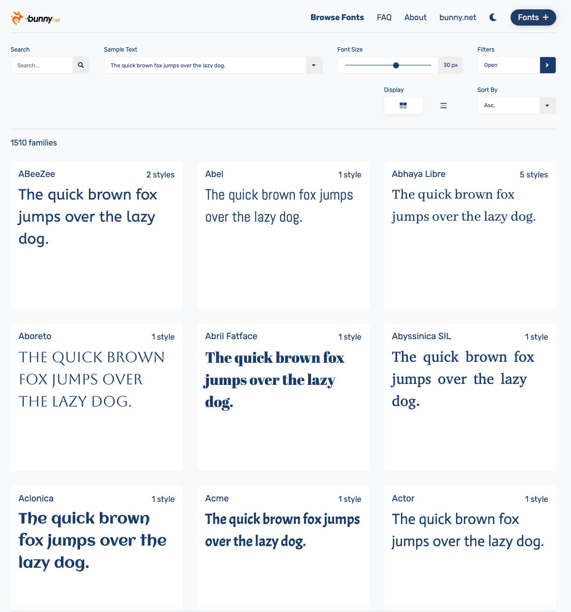
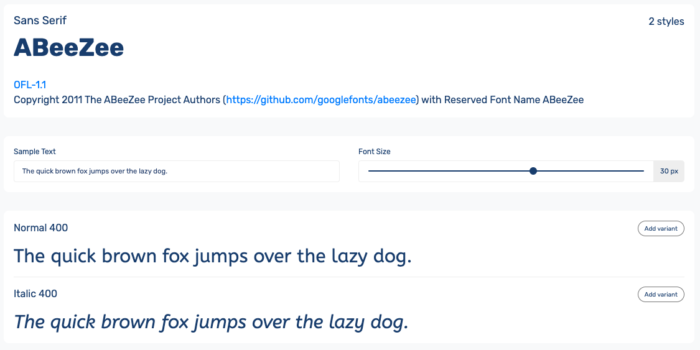
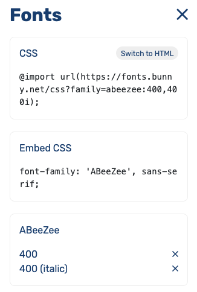

As you probably already know or in case you don't, google fonts is no longer legal in Europe.
This is due to the GDPR, which is a regulation for applications serving Europe, so that platforms do not collect user information without making it clear.
The fines can be up to 1 million euros, so it is better to think about alternatives.

I have been researching, and a very good alternative is [**Bunny Fonts**](https://fonts.bunny.net).
The interface is very similar to Google Fonts and so is the font import.
It just looks like a Google Fonts clone but is GDPR compliant.

## How do I import a font from bunny fonts?

Simple. Here is a screenshot of the Bunny Fonts home page:


Choose the desired font. Click the _add variant_ button for each variant you want to import.


This window will open, if not, click _Fonts +_.


And now you only have to copy and paste those styles in your css file, like this:
```css
@import url(https://fonts.bunny.net/css?family=abeezee:400,400i);

body {
  font-family: 'ABeeZee', sans-serif;
}
```

## Outro

You have already seen how similar bunny fonts is to google fonts.
So remember to use this page instead of google fonts, unless you want to get a big fine!

Thanks for reading this article!
