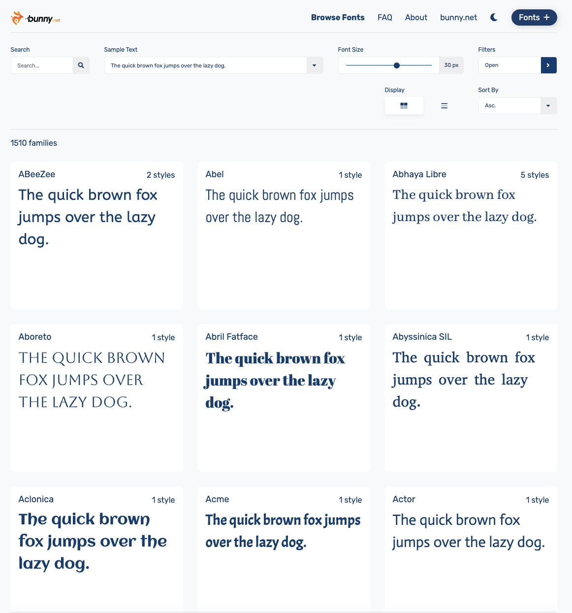
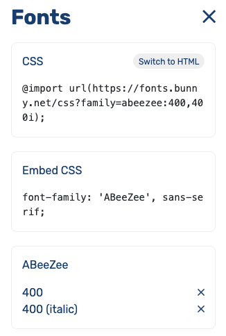

Como seguramente ya sabras o por si no lo sabes, google fonts ha dejado de ser legal en europa.
Esto es debido a la GDPR, que es una regulacion para las aplicaciones que dan servicio a europa, para que las plataformas no recolecten informacion del usuario sin dejarlo claro.
Las multas pueden ser de hasta 1 millon de euros, asi que es mejor pensar en alternativas.

He estado investigando, y una muy buena alternativa es [**Bunny Fonts**](https://fonts.bunny.net).
La interfaz es muy parecida a la de Google Fonts y la importacion de las fuentes tambien lo es.
Simplemente parece el clon de Google Fonts pero cumple con la GDPR.

## Como importo una fuente de bunny fonts?

Sencillo. Aqui puedes ver una imagen de la pagina principal de Bunny Fonts:


Elige la fuente deseada. Dale al boton _add variant_ para cada variante que quieres importar.


Se te abrira esta ventana, si no, dale a _Fonts +_.


Y ahora solo te queda copiar y pegar esos estilos en tu archivo css, de esta manera:
```css
@import url(https://fonts.bunny.net/css?family=abeezee:400,400i);

body {
  font-family: 'ABeeZee', sans-serif;
}
```

## Outro

Ya has visto como de parecido es bunny fonts a google fonts.
Asi que recuerda de usar esta pagina en vez de la de google fonts, a menos de que quieras tener una multa muy gorda!

Gracias por leer este articulo!
